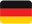

# Emoji Unicode Country Flags

Collection of 259 Unicode country flags as CSS classes 

Copyright &copy; by Andreas Kempf <https://github.com/AAKempf>  
Copyright &copy; by Valery Votintsev <https://github.com/codersclub>

## Use

Include the file flags.min.css and use the following syntax:

```
<link href="flags.min.css" rel="stylesheet" type="text/css" media="screen">
<i class="flag-de"></i>
```

The ISO code of the country is added to the class "flag-".
Here, "de" is added, sho "flag-de" displays the Geman flag: .

#### Advantages:
- No graphic files are required
- Very fast loading time (about 10K CSS)
- Works ok both in Firefox and Chromium-base browsers
- The flag sizes can be easily changed without loss of quality


#### Disadvantages:
- Layout changes depending on operating system
- Not usable as background image

## Update for Chromium based browsers
The problem with Google Chrome an other Chromium-based browsers is solved
using the font: "Twemoji Country Flags".
"Twemoji Country Flags" is just a subset of “Twemoji Colr” font from Mozilla (<https://github.com/mozilla/twemoji-colr>),
it consists of flags emoji only, so the file size is only 78kb.

### Other

Demo: <https://codersclub.ru/flags/>

Countries and codes: countries.json

Details about flags: <https://emojipedia.org/flags/>

